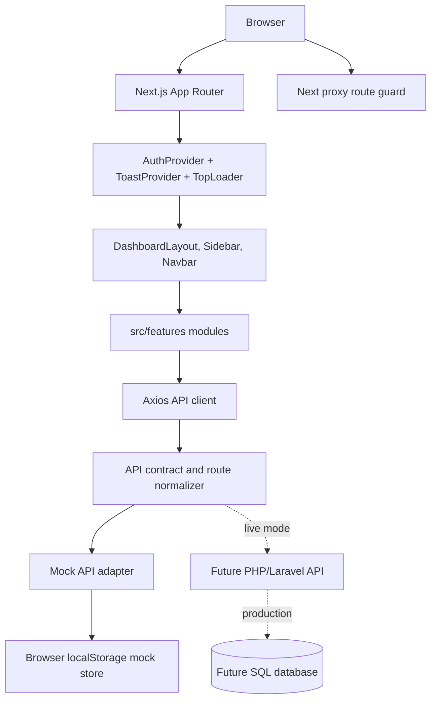
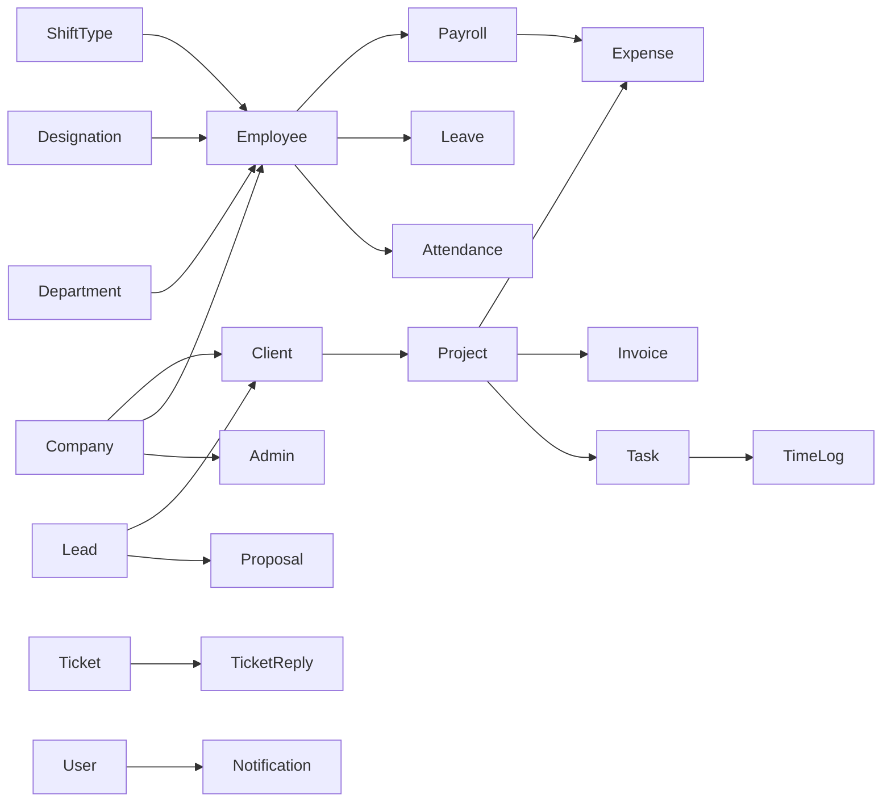
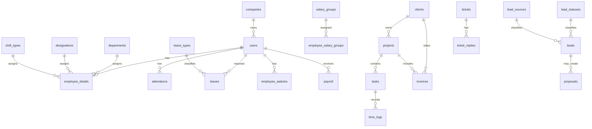

# Enterprise HRMS System Analysis and Backend Blueprint

Generated for: `nextjs-ui`

Analysis date: 2026-05-19

Primary scope: the Next.js HRMS frontend in `nextjs-ui`.

Secondary context: the repository root also contains an older Laravel/Worksuite-style backend with `Modules/RestAPI`, `Modules/Payroll`, migrations, and Laravel configuration. This document treats that backend as an available reference or possible integration target, but the active Next.js application currently runs through the frontend API contract and mock API adapter.

## Scope, Evidence, and Assumptions

| Area | Finding |
|---|---|
| Frontend framework | Next.js App Router, React 19, TypeScript, Tailwind CSS 4 |
| Source inventory | 536 source files in `src`, including 221 app files, 264 feature files, 32 component files, and 13 lib files |
| Static assets | 1546 files under `public`, including legacy plugin assets |
| API mode | `NEXT_PUBLIC_API_MODE=mock` by default |
| API base | `NEXT_PUBLIC_API_BASE_URL=http://localhost:8080/api` |
| Backend inside Next.js app | No server route handlers for business APIs were found. The app uses an Axios mock adapter backed by browser `localStorage`. |
| Adjacent backend | Root Laravel app exists with REST API and Payroll modules, migrations, notifications, payment gateways, Slack/Pusher/Twilio-like packages, and many legacy tables. |
| Tests | No first-party Next.js test suite found. Only third-party public plugin test files exist. |
| CI/CD | No `.github` workflow or Docker setup found in `nextjs-ui`. |
| Current local git note | `src/app/role-permission/page.tsx` had an unrelated local modification before this document was created. |

Important assumption: where the Next.js application does not include a real backend table or endpoint implementation, this document labels the section as "mocked", "frontend-only", or "recommended backend design". It does not pretend localStorage is a production database.

---

# 1. Project Overview

## What the HRMS Project Does

This project is an HRMS and work management application. It combines:

- Company and admin management for platform owners.
- Employee records, departments, teams, designations, shifts, attendance, leaves, holidays, and payroll.
- Project, task, time log, issue, discussion, and file workflows.
- Client, lead, contract, product, estimate, invoice, payment, expense, and proposal workflows.
- Recruitment, tickets, messages, events, notices, reports, settings, and user profile screens.

In simple business terms: it is meant to help a company run daily HR operations, manage employees and clients, track work, process payroll, handle sales leads, and keep records in one system.

## Main Objectives

| Objective | Meaning |
|---|---|
| Centralize HR data | Keep employees, departments, shifts, attendance, leaves, documents, and payroll together. |
| Support role-based access | Show different portals for super admin, company admin, employee, and client. |
| Prepare for backend migration | Keep frontend API calls normalized under `/v1/*` so a real PHP/Laravel backend can replace the mock API. |
| Improve operational visibility | Dashboards, reports, payroll status, lead kanban, attendance summaries, and project workspaces provide management visibility. |
| Support future SaaS mode | Billing/package modules exist but are controlled by product configuration. |

## Target Users

| User | Business responsibility | Default route |
|---|---|---|
| Super Admin | Owns platform-level setup, companies, branch records, first company admins, and global settings. | `/super-admin/dashboard` |
| Company Admin | Manages company HR, employees, clients, projects, finance, payroll, recruitment, settings, and reports. | `/dashboard` |
| Employee | Uses employee portal for dashboard, attendance, leaves, tasks, tickets, messages, notices, profile, and payslips. | `/member/dashboard` |
| Client | Uses client portal for assigned projects, invoices, estimates, payments, tickets, messages, notices, and profile. | `/dashboard/client` |

## Business Value

The system reduces fragmented HR and project operations. Instead of employees, admins, finance, and clients working from spreadsheets and disconnected tools, the HRMS provides a shared operational portal. The current codebase is not yet production-backend complete, but the module coverage is broad and the UI already demonstrates most workflows.

## High-Level Architecture Summary



## Application Startup Lifecycle

1. Browser loads a route from `src/app`.
2. `src/proxy.ts` checks route access before the page renders.
3. `src/app/layout.tsx` mounts global CSS, `NextTopLoader`, `ToastProvider`, and `AuthProvider`.
4. `AuthProvider` reads stored user data from `src/lib/session.ts`.
5. If unauthenticated, the user is redirected to `/login`.
6. If authenticated but unauthorized, the user is redirected to `/unauthorized`.
7. The route file renders a feature page, usually from `src/features`.
8. Feature pages call `src/lib/api.ts`.
9. `api.ts` normalizes the URL through `src/lib/api-contract.ts`.
10. In mock mode, Axios uses `src/lib/mock-api.ts`; in live mode it sends HTTP requests to the backend.

## Request Lifecycle

```text
Feature page submits action
        |
        v
api.get/post/put/delete(...)
        |
        v
normalizeApiPath()
        |
        +-- /employee -> /v1/employees
        +-- /lead-status -> /v1/lead-statuses
        +-- /payroll/updateStatus -> /v1/payroll/update-status
        |
        v
Request interceptor attaches Authorization: Bearer <token>
        |
        v
Mock adapter or live backend
        |
        v
Response envelope { success, data, message, meta }
        |
        v
Feature page updates local UI state
```

---

# 2. Complete Module Analysis

## Complete Feature Domain Inventory

Every directory under `src/features` is listed here. Some domains are fully API-connected through the mock adapter, while others are placeholder/admin CRUD screens waiting for complete backend endpoints.

| Feature domain | Business purpose | Main frontend pattern | Backend setup required |
|---|---|---|---|
| `account-setup` | Initial company setup | Form page calling account setup API | Persist company profile, timezone, currency, branding, defaults |
| `attendance` | Daily attendance, live feed, roster, summaries, bulk/date views, deductions | Dedicated feature pages plus attendance components and service calls | Attendance table, raw punch table, device sync, policies, overrides, audit logs |
| `attendance-settings` | Legacy attendance settings page | Settings form | Persist attendance rules and office days |
| `auth` | Login screen | React Hook Form + Zod, API login fallback | Real login endpoint, password hashing, token issuing, refresh/session handling |
| `billing` | SaaS billing/package area | Billing summary UI | Only needed if SaaS billing is enabled; packages, subscriptions, invoices, offline payments |
| `client-contacts` | Client contact management | CRUD-style page | Contact table tied to client/company |
| `clients` | Client records and client detail | List/create/detail/edit pages | Client table, client details, contacts, notes, documents, GDPR |
| `client-settings` | Client categories/settings | Create/config screens | Client category/subcategory tables |
| `contracts` | Contract documents and contract types | List/create/type pages | Contracts, contract types, signatures/files |
| `credit-notes` | Finance credit notes | List/detail pages | Credit note table, items, invoice application ledger |
| `currencies` | Currency setup | CRUD-style page | Currency table with code, symbol, exchange rate |
| `custom-fields` | Dynamic custom fields | Settings page | Custom field definitions and custom field values per module |
| `dashboard` | Admin, HR, finance, project, ticket, client dashboards | Dashboard pages with cards/charts | Aggregation endpoints and report queries |
| `designations` | Job titles | List/create pages | Designations table |
| `discussion` | Project/work discussions | List/create/category/reply pages | Discussion threads, replies, categories, permissions |
| `email-settings` | SMTP/email sender setup | Settings form | SMTP settings, mail driver, test email endpoint |
| `employee-faq` | Employee FAQ | FAQ/category pages currently disabled in access contract | FAQ and category tables if restored |
| `employees` | Employee records, create/edit/detail, role assignment matrix | API-connected forms and permission matrix | Users, employee details, departments, designations, shifts, docs, activities |
| `estimates` | Client estimates | List/create/detail pages | Estimate table, items, approval/conversion to invoice |
| `events` | Events and event calendar/types | List/create/calendar/type pages | Events, attendees, recurrence/reminders |
| `expense-categories` | Expense categories | CRUD-style page | Expense category table |
| `expenses` | Company/project expenses | List/create/detail/recurring pages | Expense table, categories, approvals, files |
| `faqs` | FAQ page | Feature exists but route is disabled by access contract | FAQ backend if enabled |
| `gdpr` | GDPR controls | Static/settings page | Consent records, export/delete requests |
| `google-calendar-settings` | Google Calendar integration settings | Settings page | OAuth credentials and calendar sync jobs |
| `holidays` | Holiday calendar | List/create pages | Holiday table and attendance/payroll integration |
| `invoices` | Invoices and recurring invoices | List/create/detail/settings pages | Invoice table, items, taxes, payments, PDF, email, recurring job |
| `issues` | Project issues | Issue page | Issues table tied to project/tasks |
| `leads` | CRM lead pipeline | List/create/detail/edit/kanban/settings pages | Leads, lead sources/statuses/categories, followups, files, GDPR, proposals |
| `leaves` | Leave requests, all leaves, settings, leave types | List/create/detail/settings pages | Leave requests, leave types, quotas, approvals |
| `member` | Employee/member portal | Member dashboard and payroll pages | Self-scoped employee endpoints |
| `message-settings` | Message settings | Settings page | Message preferences and retention settings |
| `module-settings` | Module toggles per role | Settings UI | Role-module visibility table |
| `notes` | Notes | CRUD-style page | Notes table with owner/module reference |
| `notices` | Notice board | List/create pages | Notices table, audience targeting, read receipts |
| `notifications` | Notification center | Notification page | Notification table, read status, delivery channels |
| `payment-gateway-credentials` | Payment gateway setup | Settings page | Gateway credentials, webhook secrets, encrypted storage |
| `payments` | Payment records | List/create/detail pages | Payments table, gateway refs, invoice/project links |
| `payroll` | Payroll generation/settings/payslips | API-connected payroll list and setup pages | Payroll cycles, salary components, groups, salary history, slips, tax slabs, payment methods |
| `products` | Products/services | List/create pages | Product table, taxes, pricing |
| `profile` | User profile | Profile form | User profile endpoint and password update |
| `project-categories` | Project categories | CRUD-style page | Project category table |
| `projects` | Projects and project workspace modules | List/create/detail/subpages | Projects, members, milestones, files, tasks, time logs, issues, invoices, payments |
| `project-settings` | Project settings | Settings page | Project defaults and policies |
| `project-template` | Project templates | Template page | Templates, template tasks/milestones |
| `proposals` | Sales proposals | List/detail pages | Proposal table, lead/client links, conversion |
| `pusher-settings` | Pusher realtime config | Settings page | Pusher keys and event broadcasting |
| `push-settings` | Push notification settings | Settings page | Push provider credentials and user device tokens |
| `recruitment` | Hiring workflow | Dashboard/jobs/applications/board/settings pages | Jobs, candidates, interviews, documents, onboarding, skills, questions |
| `reports` | Attendance, leave, finance, payroll, tasks, time logs, expense reports | Report pages | Aggregated report endpoints with export support |
| `role-permission` | Role permission matrix | LocalStorage and API endpoint fallback | Roles, permissions, role-permission pivot; currently one app route has unrelated local modification |
| `search` | Search page | Exists but disabled by access contract | Global search index endpoint if restored |
| `settings` | Company/admin settings | Settings hub and subpages | Company, finance, leave, attendance, notification, app settings |
| `shift-types` | Shift definitions and assignments | Rich shift page | Shift types, employee shift assignments, rotation/roster support |
| `slack-settings` | Slack integration settings | Settings page | Slack OAuth/webhook/event settings |
| `sticky-notes` | Personal notes | Local/static page | Sticky note table by user |
| `sub-task` | Subtask management | CRUD-style page | Subtasks tied to tasks |
| `super-admin` | Platform companies, admins, packages, invoices, settings | Strong componentized submodules | Platform companies, company admins, impersonation, platform settings, optional SaaS billing |
| `support-tickets` | Support tickets | CRUD-style page | Support tickets separate from company tickets if needed |
| `taskboard` | Kanban task board | Board page | Task status columns and drag/drop update endpoint |
| `task-calendar` | Task calendar | Calendar page | Task date queries and calendar feeds |
| `task-categories` | Task categories | List/create pages | Task categories table |
| `task-labels` | Task labels | CRUD-style page | Task labels table |
| `task-requests` | Client/member task requests | Request page | Task request table and approval flow |
| `tasks` | Task list/create/detail/edit | API-connected forms | Tasks, assignees, subtasks, files, comments, time logs |
| `task-settings` | Task settings | Settings page | Task defaults, reminders |
| `taxes` | Tax settings | CRUD-style page | Tax table |
| `teams` | Departments/teams | List/create pages | Departments/teams table |
| `theme-settings` | Theme settings | Settings page | Theme configuration |
| `ticket-form` | Ticket public form settings | Form builder page | Ticket form field definitions |
| `tickets` | Helpdesk tickets | List/create/detail pages | Tickets, replies, agents, groups, files, statuses |
| `ticket-settings` | Ticket settings | Settings page | Ticket channels, types, groups, templates |
| `time-logs` | Work time tracking | List/create/calendar/by-employee/active/settings | Time log table, timers, project/task links, approvals |
| `unauthorized` | Access denied page | Simple page | No backend required |
| `user-chat` | Direct/group chat | API-connected mock conversations and local uploads | Conversations, messages, participants, attachments, websocket events |

## Major Module Details

### 2.1 Authentication and Session Module

| Item | Detail |
|---|---|
| Purpose | Let users log in and keep their session available to the app. |
| Main files | `src/features/auth/login/LoginPage.tsx`, `src/context/AuthContext.tsx`, `src/lib/session.ts`, `src/lib/auth-contract.ts`, `src/proxy.ts` |
| Dependencies | `axios`, `js-cookie`, `react-hook-form`, `zod`, Next router/proxy |
| Backend status | Mocked through `/v1/auth/login`; real backend must issue tokens and user permissions. |

Flow:

1. User visits `/login`.
2. Login form validates email and password with Zod.
3. Form submits `POST /auth/login`, normalized to `POST /v1/auth/login`.
4. Mock adapter checks `admins` by email or creates a development user from email keywords.
5. `AuthContext.login()` saves token and user data through `saveSession()`.
6. Token and role are stored in cookies; user is stored in localStorage.
7. User is redirected to the default route for their role or a safe requested route.

Backend requirements:

- `POST /v1/auth/login`
- Request: `{ email, password }`
- Response: `{ success: true, data: { token, user } }`
- Passwords must be hashed with bcrypt/Argon2.
- Backend must never return password hashes.
- Backend must enforce account status, company status, MFA state, lockout policy, and token expiry.

Risks and improvements:

- Current token cookie is JavaScript-readable and not HttpOnly.
- Current user is stored in localStorage, so XSS would expose user/session data.
- Login currently falls back to development users if the API fails; this must be disabled in production.
- Login password minimum is 6 characters, while admin/employee creation requires 8; standardize policy.

### 2.2 Super Admin Module

| Item | Detail |
|---|---|
| Purpose | Manage platform-level companies, first company admins, optional packages/invoices, and global settings. |
| Main routes | `/super-admin/dashboard`, `/super-admin/companies`, `/super-admin/companies/create`, `/super-admin/admins`, `/super-admin/packages`, `/super-admin/invoices`, `/super-admin/settings` |
| Main files | `src/features/super-admin/**` |
| Dependencies | API client, auth contract, admin password validator, toast context |
| Backend status | Companies/admins are connected to mock API; packages/invoices/settings are mostly static or data-file driven. |

Business flow:

```text
Super Admin logs in
        |
        v
Creates company or branch
        |
        v
Creates first company admin with password
        |
        v
Company admin logs into company workspace
        |
        v
Super Admin can manage company/admin status or impersonate company admin
```

Technical flow:

- `createCompanyWithAdmin()` calls `apiClient.create("companies", payload)`.
- Mock `POST /v1/companies` creates the company and automatically creates an admin if `payload.admin` exists.
- `loginAsCompany()` calls `POST /v1/companies/{id}/login`.
- Mock login-as creates an impersonated admin session and stores original super admin session.
- Admin management uses `GET /admins`, `GET /companies`, `PUT /admins/{id}`, and `DELETE /admins/{id}`.

Validation flow:

- Company name and company email are required.
- Admin name and admin email are required.
- Admin password is required during company creation.
- `src/lib/admin-password.ts` requires 8 or more characters and blocks passwords matching admin name, email, email username, or company name.
- Edit admin password is optional, but if entered it must pass the same uniqueness/length rules.

Backend setup:

- Tables: `companies`, `users`, `admins` or `users` with role, `role_permissions`, `company_admins` if separated.
- On company creation, wrap company and first admin creation in one DB transaction.
- Enforce unique admin email globally or per tenant based on product decision.
- Enforce "at least one active admin per active company" on the backend, not only UI.
- Store admin password as hash only.
- Add audit log entries for company create/update/delete, admin credential update, status change, and impersonation.

Risks and improvements:

- Mock API deletes admins directly and does not fully enforce business constraints.
- Password may be kept in localStorage/mock store during development; production must not do this.
- Package/invoice modules are present but should remain hidden unless SaaS mode is enabled.

### 2.3 Admin Dashboard and Role Dashboards

| Item | Detail |
|---|---|
| Purpose | Show operational summary for each role and business area. |
| Routes | `/dashboard`, `/dashboard/hr`, `/dashboard/finance`, `/dashboard/project`, `/dashboard/ticket`, `/dashboard/client`, `/member/dashboard` |
| Main files | `src/features/dashboard/**`, `src/features/member/dashboard/MemberDashboardPage.tsx` |
| Backend status | Uses mock dashboard/report totals and resource lists. |

Flow:

1. User lands on role default route.
2. Dashboard page requests resource totals and recent records.
3. UI displays cards, charts, and summaries.
4. Sidebar and permission rules limit which dashboard links are shown.

Backend setup:

- Build dedicated aggregation endpoints instead of forcing the dashboard to fetch every table.
- Recommended endpoints:
  - `GET /v1/dashboard`
  - `GET /v1/dashboard/hr`
  - `GET /v1/dashboard/finance`
  - `GET /v1/dashboard/project`
  - `GET /v1/dashboard/ticket`
  - `GET /v1/member/dashboard`
  - `GET /v1/client/dashboard`
- Cache expensive aggregates for short periods.
- Scope every result by company and role.

Risks:

- Generic mock dashboard returns only simple totals.
- Production dashboards need indexed aggregate queries and authorization per metric.

### 2.4 Employee and HR Setup Module

| Item | Detail |
|---|---|
| Purpose | Manage employees, departments/teams, designations, shifts, documents, and employee access. |
| Routes | `/employees`, `/employees/create`, `/employees/{id}`, `/employees/{id}/edit`, `/teams`, `/designation`, `/shift-types` |
| Main files | `src/features/employees/**`, `src/features/teams/**`, `src/features/designations/**`, `src/features/shift-types/**` |
| Backend status | Employees, departments, designations, teams, shift types are seeded and CRUD-capable in mock mode. |

Create employee flow:

1. Admin opens `/employees/create`.
2. UI fetches teams, designations, and shift types.
3. Admin enters employee identity, email, employee ID, gender, department, designation, shift, and password.
4. Password is required, at least 8 characters, and cannot match name/email/employee ID.
5. Admin selects employee/admin role and module permissions through `EmployeePermissionMatrix`.
6. Form submits `POST /employee` normalized to `POST /v1/employees`.
7. After creation, UI calls `POST /employees/assignRole` with role, modules, and permissions.

Edit employee flow:

1. Admin opens `/employees/{id}/edit`.
2. UI fetches employee, department, designation, and shift data.
3. Password field is optional; if filled, it must be 8 or more characters and unique from identity values.
4. Admin can update role and module permissions through the same permission matrix.
5. UI submits `PUT /employee/{id}` and then `POST /employees/assignRole`.

Backend setup:

- Tables:
  - `users`
  - `employee_details`
  - `departments`
  - `designations`
  - `teams` or use `departments` as team source
  - `shift_types`
  - `employee_shift_assignments` for history
  - `role_permissions`
  - `user_permissions` or `model_has_permissions`
  - `employee_docs`
  - `user_activities`
- Important backend validation:
  - Unique email.
  - Unique employee ID per company.
  - Valid department/designation/shift IDs in same company.
  - Required password on create.
  - Optional password on edit.
  - Only authorized admins can assign admin-level permissions.
  - Employee status transitions should not break payroll/attendance history.

Risks:

- Create employee uses local component validation, edit employee uses Zod; validation style is inconsistent.
- The backend must not trust frontend permissions payload blindly.
- Role assignment should be transactional with employee create/update.

### 2.5 Attendance, Shift, and Device Module

| Item | Detail |
|---|---|
| Purpose | Track attendance, shift rules, live biometric scans, rosters, date/bulk views, and deduction reports. |
| Routes | `/attendance`, `/attendance/create`, `/attendance/date`, `/attendance/bulk`, `/attendance/live-feed`, `/attendance/roster`, `/attendance/summary`, `/attendance/{id}/logs`, `/attendance/settings/policies`, `/attendance/settings/shifts`, `/settings/attendance-devices` |
| Main files | `src/features/attendance/**`, `src/components/attendance/**`, `src/lib/hr-utils.ts`, `src/services/attendance/**`, `src/lib/realtime/**` |
| Backend status | Attendance records and devices are mocked; realtime is an in-memory simulated event bus. |

Business flow:

```text
Employee clocks in/out or biometric device sends punch
        |
        v
Backend records raw punch event
        |
        v
Attendance processor applies shift rules
        |
        v
Daily attendance status becomes present, late, half-day, absent, leave, or holiday
        |
        v
Reports and payroll consume processed attendance
```

Technical details:

- `hr-utils.ts` calculates time normalization, overnight shift handling, late minutes, half-day rules, leave units, and date ranges.
- `devices.service.ts` defines:
  - `GET /v1/attendance-devices`
  - `POST /v1/attendance-devices/{id}/sync-employees`
  - `POST /v1/attendance-devices/{id}/reboot`
  - `POST /v1/attendance-devices/{id}/clear-logs`
- `attendance.service.ts` defines:
  - `GET /v1/attendance/audit/{employeeId}/{date}`
  - `POST /v1/attendance/override`
- `src/lib/realtime/socket.ts` is a mock socket abstraction.
- `src/lib/realtime/attendance-events.ts` exposes hooks for scan and device status events.

Backend setup:

- Tables:
  - `attendance`
  - `attendance_raw_punches`
  - `attendance_devices`
  - `attendance_settings`
  - `attendance_overrides`
  - `shift_types`
  - `employee_shift_assignments`
  - `holidays`
  - `leaves`
- Jobs:
  - Device sync worker.
  - Raw punch deduplication.
  - Daily attendance recomputation.
  - Missing clock-out detection.
  - Monthly attendance lock job before payroll.
- Events:
  - `attendance.scanned`
  - `device.status.changed`
  - `attendance.override.created`

Risks:

- Current realtime layer is mock only.
- Attendance override has no approval trail in mock mode.
- Payroll depends on attendance data quality; backend must preserve raw punches even if processed records are edited.

### 2.6 Leave and Holiday Module

| Item | Detail |
|---|---|
| Purpose | Manage leave requests, leave types, leave quotas, approvals, and holidays. |
| Routes | `/leaves`, `/leaves/create`, `/leaves/{id}`, `/leaves/all`, `/leaves/settings`, `/leave-type`, `/holidays`, `/holidays/create` |
| Main files | `src/features/leaves/**`, `src/features/holidays/**`, `src/lib/hr-utils.ts` |
| Backend status | Leaves, leave types, quotas, and holidays are seeded in mock mode. |

Flow:

1. Employee or admin creates a leave request.
2. Request references employee/user, leave type, date/duration, and reason.
3. Admin reviews leave in all-leaves/approval views.
4. Status changes to approved/rejected.
5. Attendance and payroll treat approved paid leaves as payable days depending on payroll generation settings.

Backend setup:

- Tables: `leave_types`, `leave_quotas`, `leaves`, `holidays`, `leave_approval_logs`.
- Backend must calculate available quota and prevent overuse unless policy allows negative balance.
- Backend must handle half-day and multi-day leaves.
- Approved leave changes should trigger attendance recalculation and payroll warning if payroll is already locked.

Risks:

- Some leave pages use older singular aliases like `/leave` and `/leaveType`; normalization handles this but the real backend should expose plural `/v1/leaves` and `/v1/leave-types`.

### 2.7 Payroll Module

| Item | Detail |
|---|---|
| Purpose | Configure salary, generate payslips, review/lock/pay payroll, and connect payroll with attendance, leaves, expenses, and time logs. |
| Routes | `/payroll`, `/payroll/settings`, `/member/payroll`, `/reports/payroll` |
| Main files | `src/features/payroll/**`, `src/features/member/payroll/**`, `src/lib/payroll-utils.ts`, `docs/payroll-backend-contract.md` |
| Backend status | Mock API contains meaningful payroll generation logic in frontend code; production must move it backend-side. |

Payroll generation flow:

```text
Admin selects month, year, cycle, filters
        |
        v
UI loads employees, salary histories, salary groups, cycles, departments, designations, payment methods
        |
        v
UI checks readiness: employee active + salary exists + salary group assigned + payroll allowed
        |
        v
POST /v1/payroll/generate
        |
        v
Backend calculates payslips from salary, attendance, leave, holidays, expenses, time logs, and TDS
        |
        v
Payslips move through generated -> review -> locked -> paid
```

Important endpoints:

- `GET /v1/payroll`
- `POST /v1/payroll/generate`
- `POST /v1/payroll/update-status`
- `POST /v1/payroll/cycle-data`
- `GET|POST|PUT|DELETE /v1/payroll-cycles`
- `GET|POST|PUT|DELETE /v1/salary-components`
- `GET|POST|PUT|DELETE /v1/salary-groups`
- `GET|POST|PUT|DELETE /v1/employee-salaries`
- `GET|POST|PUT|DELETE /v1/employee-salary-groups`
- `GET|POST|PUT|DELETE /v1/employee-payroll-cycles`
- `GET|POST|PUT|DELETE /v1/salary-tds`
- `GET|POST|PUT|DELETE /v1/salary-payment-methods`
- `GET|POST|PUT|DELETE /v1/payroll-settings`

Backend setup:

- Use the root Laravel `Modules/Payroll` migrations and entities as a useful model reference.
- Move payroll calculations from frontend mock into backend service classes.
- Payroll generation must be idempotent by employee, period, cycle, and date range.
- Paid payroll should optionally create an approved expense ledger entry.
- Payroll locks should block attendance/leave mutations unless an authorized adjustment flow exists.

Risks:

- Current mock payroll calculation is client-side and not authoritative.
- Currency defaults to PKR in formatting utilities but other finance pages use USD examples; standardize company currency.
- Payroll needs a strong audit trail because it affects salary payments.

### 2.8 Projects, Tasks, Time Logs, and Work Management

| Item | Detail |
|---|---|
| Purpose | Manage client/internal projects, tasks, task board/calendar, time logs, discussions, files, issues, milestones, invoices, expenses, and payments. |
| Routes | `/projects`, `/projects/create`, `/projects/{id}`, project subroutes, `/tasks`, `/tasks/create`, `/tasks/{id}`, `/taskboard`, `/task-calendar`, `/time-logs/*`, `/discussion/*`, `/issues` |
| Main files | `src/features/projects/**`, `src/features/tasks/**`, `src/features/time-logs/**`, `src/components/admin/ProjectWorkspacePage.tsx` |
| Backend status | Projects, tasks, time logs, and generic admin pages work through mock/generic CRUD. |

Flow:

1. Admin creates project and links it to a client.
2. Admin assigns members and creates tasks.
3. Employees view assigned tasks and log time.
4. Project workspace displays related tasks, files, discussions, issues, invoices, expenses, payments, milestones, and notes.
5. Reports aggregate task and time log performance.

Backend setup:

- Tables:
  - `projects`, `project_members`, `project_categories`, `project_files`
  - `tasks`, `task_users`, `sub_tasks`, `task_categories`, `task_labels`, `task_history`
  - `time_logs`, `taskboard_columns`
  - `discussions`, `discussion_replies`, `discussion_categories`
  - `issues`, `milestones`, `notes`
- Add status change endpoints for kanban movement.
- Add file upload endpoints and virus scanning.
- Add project permissions: admin, project admin, assigned member, client viewer.

Risks:

- Some workspace modules use reusable generic components, which is good for speed but needs backend-specific validation.
- Drag/drop persistence for boards needs dedicated update endpoints.

### 2.9 Leads and CRM Module

| Item | Detail |
|---|---|
| Purpose | Manage prospects through list, create, edit, detail, kanban, lead settings, followups, files, GDPR, and proposals. |
| Routes | `/leads`, `/leads/create`, `/leads/{id}`, `/leads/{id}/edit`, `/leads/kanban`, `/lead-form`, `/lead-settings`, `/lead-settings/source/create`, `/lead-settings/status/create`, `/lead-settings/category/create` |
| Main files | `src/features/leads/**`, `src/lib/mock-api.ts` lead payload builders |
| Backend status | Recently connected to mock API with seeded leads, statuses, sources, and categories. |

Lead list flow:

1. Page requests `GET /lead` and `GET /lead-status`.
2. API normalizes these to `/v1/leads` and `/v1/lead-statuses`.
3. UI filters by search and status locally.
4. Actions route to view/edit/delete.

Lead create flow:

1. Page loads lead sources and statuses.
2. User submits client name, email, company, phone, website, source, status, value, address, description.
3. UI posts to `/lead`.
4. Mock payload normalizes relationships and adds source/status/category objects.

Lead detail flow:

1. Page requests `GET /lead/{id}`.
2. Displays profile, proposals, files, followups, GDPR, and activity tabs.
3. If backend fails, the current code uses preview/starter data.

Backend setup:

- Tables:
  - `leads`
  - `lead_sources`
  - `lead_statuses`
  - `lead_categories`
  - `lead_followups`
  - `lead_files`
  - `lead_gdpr_consents`
  - `lead_activities`
  - `proposals`
- Add indexed search by lead name, email, company, source, status.
- Add kanban status update endpoint, for example `PATCH /v1/leads/{id}` with `status_id`.
- Add conversion flow from lead to client/project/proposal.

Risks:

- Lead form builder is frontend-only and copies static iframe text.
- Lead detail actions like "Send Email" are UI placeholders unless backend endpoints are added.

### 2.10 Clients, Contracts, Products, and Finance

| Item | Detail |
|---|---|
| Purpose | Manage external customers, commercial documents, product catalog, invoices, payments, expenses, proposals, estimates, contracts, credit notes, currencies, taxes, and payment gateway credentials. |
| Routes | `/clients/*`, `/contracts/*`, `/products/*`, `/invoices/*`, `/estimates/*`, `/proposals/*`, `/payments/*`, `/expenses/*`, `/credit-notes/*`, `/currencies`, `/taxes`, `/payment-gateway-credentials`, `/billing` |
| Main files | `src/features/clients/**`, `src/features/contracts/**`, `src/features/products/**`, finance feature directories, `src/components/admin/FinanceDocumentPage.tsx` |
| Backend status | Many resources use mock CRUD. Payment gateway and billing are settings/demo-oriented. |

Flow:

1. Admin creates client.
2. Admin creates project/contract/proposal/estimate/invoice linked to client.
3. Payment records are created manually or by gateway webhook in production.
4. Expenses can be linked to projects and affect finance reporting.
5. Credit notes adjust invoice balances.

Backend setup:

- Tables:
  - `clients`, `client_details`, `client_contacts`
  - `contracts`, `contract_types`
  - `products`, `taxes`, `currencies`
  - `invoices`, `invoice_items`
  - `estimates`, `estimate_items`
  - `proposals`
  - `payments`
  - `expenses`, `expense_categories`
  - `credit_notes`, `credit_note_items`, `credit_note_applications`
  - `payment_gateway_credentials`
- Add PDF generation for invoices/estimates/proposals/contracts.
- Add email delivery queue.
- Add payment gateway webhooks with signature verification.

Risks:

- Payment credential fields are UI-only and must be encrypted at rest in production.
- Finance document actions can show "queued for PHP API wiring", meaning backend work is incomplete.

### 2.11 Recruitment Module

| Item | Detail |
|---|---|
| Purpose | Hiring workflow: jobs, applications, board, interviews, documents, onboarding, questions, skills, todos, categories, departments, locations, settings, archive. |
| Routes | `/recruitment/dashboard`, `/recruitment/jobs`, `/recruitment/jobs/create`, `/recruitment/applications`, `/recruitment/applications/create`, `/recruitment/applications/{id}`, `/recruitment/applications/board`, and more recruitment subroutes |
| Main files | `src/features/recruitment/**` |
| Backend status | Many pages are static/local-state and need full persistence. |

Backend setup:

- Tables:
  - `recruitment_jobs`
  - `job_categories`, `job_locations`, `job_skills`
  - `job_applications`
  - `application_statuses`
  - `interviews`
  - `candidate_documents`
  - `onboarding_tasks`
  - `recruitment_questions`
- Add workflow transitions: applied, screened, interview, offer, hired, rejected, archived.
- Add email scheduling and calendar integration for interviews.

Risks:

- Recruitment is broad but less backend-connected than employees/payroll/leads.
- Document uploads need real storage.

### 2.12 Tickets, Messages, Events, Notices, and Notifications

| Item | Detail |
|---|---|
| Purpose | Internal/external communication and support. |
| Routes | `/tickets`, `/tickets/create`, `/tickets/{id}`, `/support-tickets`, `/ticket-form`, `/ticket-settings`, `/user-chat`, `/events`, `/event-calendar`, `/notices`, `/notifications`, settings pages |
| Main files | `src/features/tickets/**`, `src/features/user-chat/**`, `src/features/events/**`, `src/features/notices/**`, `src/features/notifications/**` |
| Backend status | Tickets, chat, events, and notices have mocked/local behaviors; notifications are mostly UI/static. |

Flow:

- Tickets: requester submits issue, admin/agent updates status and replies.
- Chat: direct/group conversation loads participants, messages, and local uploaded attachments.
- Events: admin creates events and attendees see event/calendar views.
- Notices: admin posts notice to a target audience.
- Notifications: current navbar only shows notification icon for employees.

Backend setup:

- Tables:
  - `tickets`, `ticket_replies`, `ticket_files`, `ticket_groups`, `ticket_channels`, `ticket_types`
  - `chat_conversations`, `chat_participants`, `chat_messages`, `chat_attachments`
  - `events`, `event_attendees`
  - `notices`, `notice_reads`
  - `notifications`, `notification_preferences`, `device_tokens`
- Use websockets for chat and realtime notifications.
- Use queues for email/push/slack notifications.

Risks:

- Chat uploads currently use local base64 previews, not durable file storage.
- Notification center is not integrated with a real event delivery system.

### 2.13 Settings, Integrations, Reports, and Utilities

| Item | Detail |
|---|---|
| Purpose | Configure company, finance, attendance, leave, language, profile, app settings, roles, notifications, integrations, and reports. |
| Routes | `/settings/*`, `/role-permission`, `/module-settings`, `/reports/*`, `/email-settings`, `/slack-settings`, `/pusher-settings`, `/push-settings`, `/google-calendar-settings`, `/theme-settings`, `/gdpr` |
| Main files | `src/features/settings/**`, `src/features/reports/**`, integration settings feature dirs |
| Backend status | Mixed. Reports mostly query mock resources; integration settings are UI-only. |

Backend setup:

- Tables:
  - `settings`
  - `organisation_settings`
  - `smtp_settings`
  - `theme_settings`
  - `module_settings`
  - `email_notification_settings`
  - `integration_settings`
  - `report_exports`
- Add export endpoints for CSV/XLSX/PDF.
- Add audit logging for settings changes.
- Encrypt secrets for SMTP, Slack, Pusher, Google, payment gateways.

Risks:

- Some settings links in sidebar/layout use inconsistent paths.
- Integration settings must not store credentials in frontend state only.

---

# 3. Complete API Documentation

## API Base and Versioning

Configured in `.env.local`:

```env
NEXT_PUBLIC_API_BASE_URL=http://localhost:8080/api
NEXT_PUBLIC_API_TIMEOUT_MS=5000
NEXT_PUBLIC_API_MODE=mock
```

All production backend routes should live under:

```text
/api/v1
```

The frontend may call older singular paths, but `normalizeApiPath()` converts them into plural v1 routes.

Examples:

| Frontend call | Normalized backend route |
|---|---|
| `/employee` | `/v1/employees` |
| `/employee/1` | `/v1/employees/1` |
| `/lead` | `/v1/leads` |
| `/lead-source` | `/v1/lead-sources` |
| `/payroll/updateStatus` | `/v1/payroll/update-status` |
| `/salary-payment-methods` | `/v1/salary-payment-methods` |

## Standard Response Envelope

```json
{
  "success": true,
  "data": {},
  "message": "Optional message",
  "meta": {
    "current_page": 1,
    "last_page": 1,
    "per_page": 20,
    "total": 0
  }
}
```

Validation and error responses should use HTTP status codes:

```json
{
  "success": false,
  "data": null,
  "message": "The email field is required."
}
```

## Authentication Headers

The frontend sends:

```text
Authorization: Bearer <token>
Accept: application/json
Content-Type: application/json
X-Frontend-Client: nextjs-ui
X-Api-Mode: mock | live
```

On HTTP `401`, the frontend removes token/user data and redirects to `/login`.

## Generic CRUD Endpoint Contract

Unless marked as special, the resources below should support the same REST pattern.

| Method | Endpoint | Purpose |
|---|---|---|
| `GET` | `/v1/{resource}` | List records, optionally filtered/paginated |
| `POST` | `/v1/{resource}` | Create record |
| `GET` | `/v1/{resource}/{id}` | Show one record |
| `PUT` | `/v1/{resource}/{id}` | Replace/update record |
| `PATCH` | `/v1/{resource}/{id}` | Partial update |
| `DELETE` | `/v1/{resource}/{id}` | Delete/archive record |

List query format:

```text
?page=1&per_page=20&search=abc&status=open&include=client,project&sort=created_at&direction=desc
```

## API Resource Inventory

| Resource | Used by modules | Backend notes |
|---|---|---|
| `account-setup` | Account setup | Company initialization/settings |
| `admins` | Super admin admins | Super admin only |
| `attendance` | Attendance, reports, member dashboard, payroll | Must include audit/override behavior |
| `attendance-settings` | Attendance settings, reports | Company scoped |
| `billing` | Billing/SaaS | Only if SaaS billing enabled |
| `clients` | Clients, projects, finance, tickets | Company scoped |
| `chat-conversations` | User chat | Requires participants |
| `chat-messages` | User chat | Requires conversation scope |
| `companies` | Super admin companies | Platform scoped |
| `contacts` | Client contacts | Client scoped |
| `contracts` | Contracts | Client/project scoped |
| `credit-notes` | Finance | Invoice ledger integration |
| `currencies` | Finance/settings | Company/global currency setup |
| `departments` | Employees, teams, attendance, payroll | HR setup |
| `designations` | Employees, payroll | HR setup |
| `discussions` | Project discussions | Project scoped |
| `employees` | Employees, payroll, reports, attendance, tasks | User plus employee detail |
| `estimates` | Finance | Convertible to invoice |
| `events` | Events/calendar | Attendees/reminders |
| `expenses` | Finance, payroll paid expense | Approval and files |
| `holidays` | Attendance, leaves, payroll | Attendance/payroll effect |
| `employee-docs` | Employee detail | File storage required |
| `leave-quotas` | Leaves/reports | Per employee/type |
| `invoices` | Finance/client portal | Items, tax, payments |
| `leads` | CRM | Sources/status/category/followups |
| `leaves` | Leave management, attendance, payroll | Approval flow |
| `notices` | Notice board | Audience/read receipts |
| `payments` | Finance | Gateway/manual payments |
| `payroll` | Payroll, member payroll | Generation/status flow |
| `payroll-cycles` | Payroll settings | Monthly/weekly/biweekly/semimonthly |
| `payroll-settings` | Payroll settings | TDS, finance month, extra fields |
| `products` | Products/invoices | Product catalog |
| `projects` | Projects/tasks/finance | Client/member scope |
| `proposals` | Leads/finance | Sales proposal flow |
| `reports` | Reports/dashboard | Aggregation endpoints |
| `role-permission` | RBAC settings | Role permission persistence |
| `settings` | Global/company settings | Multiple settings groups |
| `salary-components` | Payroll settings | Earnings/deductions |
| `salary-groups` | Payroll settings | Component grouping |
| `salary-payment-methods` | Payroll payment | Payment method choices |
| `salary-tds` | Payroll tax | Tax slabs |
| `shift-types` | Attendance/employees | Shift rules |
| `tasks` | Tasks/projects/member | Assignment/status/time logs |
| `tickets` | Tickets/support | Replies/files/statuses |
| `time-logs` | Time tracking/reports/payroll | Project/task/member scoped |
| `employee-salaries` | Payroll settings | Salary history and payroll enabled state |
| `employee-salary-groups` | Payroll settings | Employee to salary group |
| `employee-payroll-cycles` | Payroll settings | Employee to payroll cycle |
| `user-activities` | Employee detail/audit | Activity log |

## Special Endpoint Documentation

| Endpoint | Method | Purpose | Request payload | Response data | Auth |
|---|---|---|---|---|---|
| `/v1/auth/login` | `POST` | Authenticate user | `{ email, password }` | `{ token, user }` | Public |
| `/v1/dashboard` | `GET` | Admin dashboard totals | Query filters optional | `{ totals, generated_at }` | Authenticated |
| `/v1/reports` | `GET` | Report summary | Query filters optional | `{ totals, generated_at }` in mock | Authenticated |
| `/v1/companies/{id}/login` | `POST` | Super admin impersonates company admin | Empty or reason payload | `{ token, user }` | Super admin |
| `/v1/employees/assignRole` | `POST` | Assign employee/admin role and module permissions | `{ user_id, role, permissions, modules }` | Updated employee | Admin |
| `/v1/role-permission/assignRole` | `POST` | Save role permissions | `{ role, permissions }` | Save confirmation | Admin |
| `/v1/attendance-devices` | `GET` | List biometric devices | None | Device list | Admin |
| `/v1/attendance-devices/{id}/sync-employees` | `POST` | Push employee roster to device | Optional sync options | `{ success: true }` | Admin |
| `/v1/attendance-devices/{id}/reboot` | `POST` | Reboot device | None | `{ success: true }` | Admin |
| `/v1/attendance-devices/{id}/clear-logs` | `POST` | Clear device logs | None | `{ success: true }` | Admin |
| `/v1/attendance/audit/{employeeId}/{date}` | `GET` | Show raw punches and processed attendance | Path params | `{ punches, processed_attendance }` | Admin/authorized employee |
| `/v1/attendance/override` | `POST` | Manual attendance correction | `{ employee_id, date, clock_in, clock_out, status, reason }` | `{ success: true }` | Admin |
| `/v1/payroll/generate` | `POST` | Generate payslips | Payroll period/options | `{ generated, skipped, period }` | Admin payroll permission |
| `/v1/payroll/update-status` | `POST` | Move payslips to generated/review/locked/paid | `{ ids, status, paid_on, salary_payment_method_id, add_expenses }` | Updated slips | Admin payroll permission |
| `/v1/payroll/cycle-data` | `POST` | Return cycle ranges for selected month/year | `{ year, month, payroll_cycle_id }` | Range list | Admin payroll permission |
| `/v1/employee-salaries/status` | `POST` | Enable/disable payroll generation for employee | `{ employee_id, allow_generate_payroll }` | Updated salary records | Admin payroll permission |
| `/v1/{resource}/{id}/{action}` | `POST` | Generic approve/reject/send/mark-paid/archive action | Action-specific | Updated record | Resource permission |
| `/v1/{resource}/{id}/files` | `POST` | Upload files | `multipart/form-data` | Uploaded file list | Resource permission |

## Validation Rules by API Area

| Area | Required validation |
|---|---|
| Auth | Email format, password required, active user, active company, rate limit, lockout |
| Companies | Name/email required, unique company email, valid package/status, first admin required |
| Admins | Name/email/company required, unique email, password policy, cannot remove last active admin |
| Employees | Name/email/employee ID required, unique email, unique employee ID per company, valid role/department/designation/shift, password policy |
| Roles/permissions | Role must be known, permission keys must be allowlisted, backend must reject privilege escalation |
| Attendance | Employee/date required, valid shift, valid clock order, override reason required |
| Leaves | Employee, leave type, date/duration required, quota checks, no invalid overlap unless policy allows |
| Payroll | Period required, cycle required, employee eligibility checks, locked period protections |
| Leads | Client name/email required, source/status/category must exist if supplied |
| Finance | Client/project references valid, positive amounts, tax/currency validation, immutable paid/locked rules |
| Files | Allowed MIME types, max size, virus scan, storage path protection |

## Error Response Recommendations

| HTTP status | Meaning | Example |
|---|---|---|
| `400` | Bad request shape | Invalid date range |
| `401` | Missing/expired token | Token expired |
| `403` | Authenticated but forbidden | Employee cannot manage payroll |
| `404` | Record not found | Lead not found |
| `409` | Business conflict | Cannot delete last active admin |
| `422` | Validation failed | Email already exists |
| `429` | Rate limited | Too many login attempts |
| `500` | Server error | Unexpected payroll generation failure |

## API Relationship Map



---

# 4. Frontend Architecture Analysis

## Folder Structure

| Folder/file | Role |
|---|---|
| `src/app` | Next.js App Router pages, layouts, loading/error routes, and documentation file from earlier work |
| `src/features` | Business domain implementations and module pages |
| `src/components/layout` | Shared application shell: sidebar, navbar, dashboard layout, settings layout |
| `src/components/ui` | Reusable UI primitives: button, card, modal, input, drawer, pagination, toast, rich text editor |
| `src/components/admin` | Reusable admin/workspace/finance components |
| `src/components/attendance` | Attendance-specific reusable widgets |
| `src/components/charts` | Chart helper components |
| `src/context` | React context providers for auth and toast state |
| `src/lib` | API client, API contract, auth contract, session, mock API, payroll/HR utilities, uploads, product config |
| `src/services` | Service wrappers for attendance APIs |
| `src/types` | Shared TypeScript interfaces |
| `src/utils` | Generic helpers |
| `public` | Logos/images/legacy frontend plugin assets |
| `docs` | Technical contracts and project documentation |

## Component Architecture

The project uses a hybrid component architecture:

- Route files in `src/app` are usually thin wrappers importing feature pages.
- Feature modules contain page-level components.
- Some complex modules are strongly componentized, especially `super-admin`, attendance widgets, and admin workspace components.
- Some pages still contain large forms/tables directly inside page files.
- Reusable generic components exist for admin CRUD and finance/workspace pages.

This is partially component-based and moving toward a scalable feature-module structure. The existing `src/features/README.md` recommends a professional module format:

```text
src/features/<domain>/
  api.ts
  types.ts
  utils.ts
  use<Domain>.ts
  <Domain>Page.tsx
  components/
```

That pattern is already visible in `super-admin` and should be continued across all modules.

## Routing System

The app uses App Router. Important route groups include:

```text
/
/login
/dashboard
/dashboard/hr
/dashboard/finance
/dashboard/project
/dashboard/ticket
/dashboard/client
/member/dashboard
/member/payroll
/super-admin/dashboard
/super-admin/companies
/super-admin/companies/create
/super-admin/admins
/super-admin/packages
/super-admin/invoices
/super-admin/settings
/employees
/employees/create
/employees/[id]
/employees/[id]/edit
/attendance
/attendance/create
/attendance/date
/attendance/bulk
/attendance/live-feed
/attendance/roster
/attendance/summary
/attendance/[id]/logs
/attendance/settings/policies
/attendance/settings/shifts
/leaves
/leaves/create
/leaves/[id]
/leaves/all
/leaves/settings
/payroll
/payroll/settings
/projects
/projects/create
/projects/[id]
/projects/[id]/tasks
/projects/[id]/files
/projects/[id]/invoices
/projects/[id]/expenses
/projects/[id]/payments
/projects/[id]/milestones
/projects/[id]/members
/projects/[id]/discussions
/projects/[id]/notes
/projects/[id]/issues
/projects/[id]/gantt
/projects/[id]/burndown
/tasks
/tasks/create
/tasks/[id]
/tasks/[id]/edit
/taskboard
/task-calendar
/time-logs
/time-logs/create
/time-logs/calendar
/time-logs/by-employee
/time-logs/active
/clients
/clients/create
/clients/[id]
/clients/[id]/edit
/leads
/leads/create
/leads/[id]
/leads/[id]/edit
/leads/kanban
/lead-form
/lead-settings
/lead-settings/source/create
/lead-settings/status/create
/lead-settings/category/create
/invoices
/invoices/create
/invoices/[id]
/estimates
/estimates/create
/estimates/[id]
/proposals
/proposals/[id]
/payments
/payments/create
/payments/[id]
/expenses
/expenses/create
/expenses/[id]
/recruitment/dashboard
/recruitment/jobs
/recruitment/jobs/create
/recruitment/applications
/recruitment/applications/create
/recruitment/applications/[id]
/recruitment/applications/board
/recruitment/archive
/recruitment/settings
/reports
/reports/attendance
/reports/leave
/reports/payroll
/reports/tasks
/reports/time-log
/reports/finance
/reports/expense
/reports/income-expense
/settings
/settings/account
/settings/app
/settings/attendance
/settings/attendance-devices
/settings/company
/settings/finance
/settings/language
/settings/leave
/settings/notifications
/settings/profile
/settings/roles
/role-permission
/notifications
/unauthorized
/user-chat
```

## State Management Flow

| State type | Current implementation |
|---|---|
| Authenticated user | React context plus cookies/localStorage |
| Toasts | Toast context |
| Forms | Local `useState`, React Hook Form, and Zod mixed across modules |
| Server data | Local component state populated by Axios calls |
| Mock persistence | `localStorage` key `worksuite_mock_api_store` |
| Permissions | `auth-contract.ts`, user object permissions, some localStorage override in role permission page |
| Realtime | In-memory mock socket event bus |

Recommendation: introduce a consistent data fetching and cache layer later, such as TanStack Query, once backend endpoints stabilize.

## Form Handling and Validation

Current validation is mixed:

- Login uses React Hook Form + Zod.
- Employee edit uses React Hook Form + Zod.
- Employee create uses manual state validation.
- Super admin company/admin uses manual validation through shared password helper.
- Many pages use native `required` and local checks.

Production recommendation:

- Standardize on React Hook Form + Zod schemas.
- Put validation schemas next to module `types.ts` or `schema.ts`.
- Mirror backend validation rules exactly.
- Return structured validation errors from the backend and map them to fields.

## UI Libraries Used

| Library | Purpose |
|---|---|
| `lucide-react` | Icons |
| `nextjs-toploader` | Page transition progress |
| `recharts` | Charts |
| `react-quill` | Rich text editor |
| `react-window` | Available for virtualized lists |
| `ogl` | Visual background/canvas effects |
| `tailwindcss` | Styling |

## Performance Considerations

Current strengths:

- Feature-based route splitting through App Router.
- Large features generally load only when route is visited.
- API URL normalization centralizes backend calls.

Risks:

- Many pages are client components.
- Global search in navbar sends parallel client/employee/project requests.
- `public/plugins` includes many old plugin assets, increasing repository size.
- Tables are mostly non-virtualized even though `react-window` is installed.
- Mock localStorage reads/writes entire mock store, which is fine for demo but not scalable.

Recommendations:

- Use server-side pagination for large tables.
- Add query caching.
- Use dynamic imports for heavy editors/charts.
- Remove unused legacy public plugins.
- Add bundle analysis.

## Accessibility and Responsiveness

The UI uses responsive Tailwind grids and mobile sidebar state. Many buttons have icons and some have labels/titles. More work is needed:

- Add consistent `aria-label` to icon-only buttons.
- Ensure all modals trap focus.
- Ensure table actions are keyboard accessible.
- Add proper labels for all form fields.
- Verify color contrast for light gray text.

---

# 5. Backend Architecture Analysis

## Current Backend Behavior in the Next.js App

The Next.js app does not contain production backend route handlers for the HRMS. Instead:

- `src/lib/api.ts` creates an Axios client.
- If `NEXT_PUBLIC_API_MODE !== "live"`, Axios uses `mockApiAdapter`.
- `src/lib/mock-api.ts` simulates the backend.
- Mock records are seeded from `seedStore`.
- Mock data is persisted to browser `localStorage`.
- Mock CRUD returns the same response envelope expected from the future backend.

This is useful for frontend development but not suitable for production.

## Mock Backend Initialization Flow

```text
First API call in browser
        |
        v
mockApiAdapter reads request
        |
        v
readStore()
        |
        +-- if no localStorage store: seed from seedStore
        +-- if existing store: hydrate derived employee shift data
        +-- if schema version changed: merge lead defaults
        |
        v
filter/create/update/delete/action handling
        |
        v
writeStore() persists whole store back to localStorage
```

Mock resources include companies, admins, employees, clients, chat, projects, tasks, tickets, finance records, leaves, holidays, attendance, payroll, departments, teams, designations, lead settings, leads, settings, and more.

## Recommended Production Backend Architecture

```text
HTTP request
  -> Web server / load balancer
  -> API framework router
  -> Auth middleware
  -> Tenant/company resolver middleware
  -> Permission middleware
  -> Request validation
  -> Controller
  -> Service layer
  -> Repository/query layer
  -> Database transaction
  -> Events/queue jobs
  -> Response envelope
```

Recommended backend layers:

| Layer | Responsibility |
|---|---|
| Routes | Versioned `/api/v1/*` endpoint definitions |
| Middleware | Auth, tenant scope, RBAC, rate limit, request ID, CORS |
| Controllers | HTTP request/response handling only |
| Form requests/schemas | Validation and authorization checks |
| Services | Business logic such as payroll generation, attendance processing, lead conversion |
| Repositories/queries | Complex data retrieval and filtering |
| Events/listeners | Notifications, activity logs, integrations |
| Jobs/queues | Email, payroll PDFs, attendance device sync, imports/exports |
| Models/entities | Database mapping and relationships |
| Policies/guards | Record-level authorization |

## Backend Initialization Flow

1. Install backend dependencies.
2. Configure `.env`.
3. Generate app key/secret.
4. Run migrations.
5. Seed first super admin, core roles, permission modules, default settings, salary cycles, leave types, departments/designations if needed.
6. Start API server.
7. Configure Next.js `.env.local` to point to backend and set `NEXT_PUBLIC_API_MODE=live`.

If using the adjacent Laravel backend:

```bash
cd D:\lisamsolutionshr
composer install
cp .env.example .env
php artisan key:generate
php artisan migrate --seed
php artisan jwt:secret
php artisan serve --host=127.0.0.1 --port=8080
```

Then in `nextjs-ui/.env.local`:

```env
NEXT_PUBLIC_API_BASE_URL=http://127.0.0.1:8080/api
NEXT_PUBLIC_API_MODE=live
NEXT_PUBLIC_API_TIMEOUT_MS=10000
```

If building a clean custom PHP backend, match the `/v1/*` contract in this document and `docs/php-api-contract.md`.

## Middleware Flow

Required backend middleware:

- CORS allowing the Next.js domain.
- JSON request parsing.
- Authentication token validation.
- Tenant/company resolver.
- Role and permission checks.
- Rate limiting, especially auth and file upload endpoints.
- Audit context: user ID, company ID, request ID, IP.
- Response formatter.

## Authentication and Token Handling

Recommended:

- Access token with short expiry.
- Refresh token in HttpOnly Secure SameSite cookie, or server sessions.
- Password hashing with Argon2id or bcrypt.
- Login throttling and account lockout.
- Optional MFA for admins and payroll access.
- Token revocation on logout/password change.

## Queue and Scheduler Requirements

The current Next.js project does not implement real queues or cron jobs. Production HRMS needs:

| Job | Frequency/trigger |
|---|---|
| Attendance device sync | Every few minutes or webhook/push trigger |
| Daily attendance close | End of day per company timezone |
| Missing clock-out reminders | Scheduled |
| Leave approval reminders | Scheduled |
| Payroll generation/export | User-triggered queue job |
| Invoice recurring generation | Daily |
| Email/push/slack notifications | Event-triggered queue |
| Report export | User-triggered queue |
| Data backup | Scheduled |

## Logging Strategy

Current frontend uses `console.error` and toast messages. Production should add:

- Backend structured logs with request IDs.
- Error monitoring.
- Audit logs for sensitive actions.
- Security logs for login failures, permission denials, impersonation, password changes.
- Business logs for payroll generation, attendance overrides, leave approvals.

## Caching Strategy

Use caching for:

- Permission definitions.
- Company settings.
- Dashboard aggregates.
- Static lists such as departments/designations/currencies.
- Report result snapshots.

Avoid caching:

- Payroll values during active edits unless cache invalidation is strict.
- Attendance raw punch data.
- Security-sensitive user session state without proper controls.

---

# 6. Database Documentation

## Database Status

Inside `nextjs-ui`, there is no real database schema. The mock database is `seedStore` inside `src/lib/mock-api.ts`, persisted to browser localStorage.

The adjacent Laravel backend contains many real migrations and modules, including Payroll and RestAPI. The table plan below maps the Next.js frontend contract to production database tables.

## Logical ERD Explanation



## Model/Table Inventory

| Table/model | Purpose | Key fields | Relationships | Index recommendations |
|---|---|---|---|---|
| `companies` | Company/branch workspace | id, name, email, package, package_type, status | Has users/admins/employees/clients/projects | unique email, status |
| `users` | Login identities | id, company_id, name, email, password_hash, role, status | Belongs company; has employee/client details | unique email, company_id+role |
| `admins` or admin users | Company admins | user_id, company_id, permissions | Usually users with role admin | company_id+status |
| `employee_details` | HR profile extension | user_id, employee_id, department_id, designation_id, shift_type_id, joining_date | Belongs user/department/designation/shift | unique company_id+employee_id |
| `departments` | Teams/departments | id, company_id, name, team_name | Has employees | company_id+name |
| `designations` | Job titles | id, company_id, name | Has employees | company_id+name |
| `teams` | Team aliases if kept separate | id, company_id, name, team_name | Has employees | company_id+name |
| `shift_types` | Shift rules | start_time, end_time, grace, half_day_mark, min_hours | Assigned to employees/rosters | company_id+code |
| `employee_shift_assignments` | Shift history | employee_id, shift_type_id, effective_from/to | Attendance processing | employee_id+date |
| `attendance_devices` | Biometric devices | serial_number, ip, status, location, last_sync_at | Raw punches | unique serial_number |
| `attendance_raw_punches` | Raw device punches | employee_id, device_id, timestamp, type, status | Processed attendance | employee_id+date, device_id+timestamp |
| `attendance` | Daily attendance | employee_id, date, status, clock_in/out, late, half_day | Payroll/reports | employee_id+date unique |
| `attendance_settings` | Attendance policies | office_start, open_days, grace, overtime policy | Company | company_id |
| `attendance_overrides` | Manual changes | attendance_id, old/new values, reason, approved_by | Audit | attendance_id |
| `leave_types` | Leave categories | type_name, no_of_leaves, paid, color | Leaves/quotas | company_id+type_name |
| `leave_quotas` | Entitlement per employee/type | user_id, leave_type_id, no_of_leaves | Leaves | user_id+leave_type_id |
| `leaves` | Leave requests | user_id, type_id, leave_date/from/to, status, reason | Attendance/payroll | user_id+date/status |
| `holidays` | Company holidays | date, name/occasion | Attendance/payroll | company_id+date |
| `payroll_cycles` | Payroll periods | name, cycle, duration, status | Employee payroll cycles | cycle |
| `salary_components` | Earnings/deductions | component_name, type, value_type, values | Salary groups | company_id+status |
| `salary_groups` | Component groups | group_name, component_ids | Employee salary groups | company_id+group_name |
| `salary_group_components` | Pivot | salary_group_id, component_id | Groups/components | composite unique |
| `employee_salaries` | Salary history | employee_id, amount, type, date, allow_generate_payroll | Payroll | employee_id+date |
| `employee_salary_groups` | Employee group assignment | employee_id, salary_group_id | Payroll | employee_id |
| `employee_payroll_cycles` | Employee cycle assignment | employee_id, payroll_cycle_id | Payroll | employee_id |
| `salary_tds` | Tax/TDS slabs | salary_from, salary_to, salary_percent | Payroll | range |
| `salary_payment_methods` | Payroll payment methods | payment_method, default, status | Payroll paid flow | company_id+status |
| `payroll_settings` | Payroll config | tds_status, finance_month, tds_salary, extra_fields | Company | company_id |
| `payroll` or `salary_slips` | Payslips | employee_id, salary period, gross, deductions, net, status, paid_on | Payroll reports/member payslip | employee_id+period+cycle unique |
| `clients` | Client identities | name, email, status | Projects/invoices/tickets | company_id+email |
| `client_details` | Client company data | client_id, company_name, website, mobile, address | Client | client_id |
| `client_contacts` | Client contacts | client_id, name, email, phone | Client | client_id+email |
| `projects` | Work projects | project_name, client_id, status, start/deadline | Tasks, invoices, expenses | company_id+status, client_id |
| `project_members` | Project assignments | project_id, user_id, role | Authorization | project_id+user_id |
| `tasks` | Work items | project_id, heading, status, priority, dates | Users/time logs | project_id+status |
| `task_users` | Task assignees | task_id, user_id | Tasks | task_id+user_id |
| `sub_tasks` | Task checklist | task_id, title, status | Tasks | task_id |
| `time_logs` | Work time entries | user_id, project_id, task_id, start/end, total_hours | Reports/payroll | user_id+date, project_id |
| `task_categories` | Task categories | category_name | Tasks | company_id+name |
| `task_labels` | Task labels | label_name, color | Tasks | company_id+name |
| `task_requests` | Requested tasks | requester_id, details, status | Approval flow | status |
| `leads` | Sales prospects | client_name, client_email, company_name, source_id, status_id, category_id, value | Proposals/conversion | company_id+status_id, email |
| `lead_sources` | Lead origin | type | Leads | company_id+type |
| `lead_statuses` | Pipeline status | type, color, sort_order | Leads/kanban | company_id+sort_order |
| `lead_categories` | Lead category | category_name | Leads | company_id+category_name |
| `lead_followups` | Sales followups | lead_id, next_follow_up_date, remark, user_id | Leads | lead_id+date |
| `lead_files` | Lead documents | lead_id, filename, file_url, size | Leads | lead_id |
| `lead_gdpr_consents` | Consent records | lead_id, purpose, status, date, ip | GDPR | lead_id+purpose |
| `lead_activities` | Lead timeline | lead_id, action, details, user_id | Audit | lead_id+created_at |
| `proposals` | Sales proposals | lead_id/client_id, proposal_number, total, status | Leads/finance | company_id+status |
| `contracts` | Contracts | client_id, contract_type_id, start/end, status | Clients | client_id+status |
| `products` | Product catalog | name, price, tax_id, status | Invoices/estimates | company_id+name |
| `invoices` | Bills | client_id, project_id, invoice_number, total, status | Payments/credit notes | company_id+number unique |
| `invoice_items` | Invoice line items | invoice_id, description, qty, price, tax | Invoices | invoice_id |
| `estimates` | Quotes | client_id/project_id, number, total, status | Conversion | company_id+number unique |
| `payments` | Payment records | invoice_id, project_id, amount, method, status | Finance | invoice_id+status |
| `expenses` | Expense records | project_id, user_id, category_id, amount, status | Reports/payroll | company_id+date/status |
| `credit_notes` | Invoice credits | client_id, number, total, status | Invoice applications | company_id+number |
| `currencies` | Currency setup | code, symbol, exchange_rate | Finance/settings | code |
| `taxes` | Tax setup | name, rate | Products/invoices | company_id+name |
| `tickets` | Support tickets | requester_id, subject, status, priority, agent_id | Replies/files | company_id+status |
| `ticket_replies` | Ticket thread | ticket_id, user_id, message | Tickets | ticket_id |
| `ticket_files` | Ticket attachments | ticket_id, file_url | Tickets | ticket_id |
| `chat_conversations` | Chat rooms | type, name, settings | Messages/participants | company_id+type |
| `chat_participants` | Chat membership | conversation_id, user_id/type | Chat | conversation_id+participant |
| `chat_messages` | Chat messages | conversation_id, sender, body, attachments | Chat | conversation_id+created_at |
| `events` | Calendar events | title, date, audience, location | Attendees/notifications | company_id+date |
| `event_attendees` | Event users | event_id, user_id | Events | event_id+user_id |
| `notices` | Notice board | heading, description, audience | Notices | company_id+created_at |
| `notice_reads` | Read receipts | notice_id, user_id, read_at | Notices | notice_id+user_id |
| `notifications` | Notification records | user_id, type, title, body, read_at | Navbar/center | user_id+read_at |
| `settings` | Generic settings | type, payload | Platform/company | company_id+type |
| `smtp_settings` | Mail setup | driver, host, port, encryption, from | Email | company_id |
| `module_settings` | Module toggles | role, module, enabled | Sidebar/access | role+module |
| `role_permissions` | Role permissions | role, permission | RBAC | role+permission |
| `user_permissions` | User overrides | user_id, permission | RBAC | user_id+permission |
| `user_activities` | Activity log | user_id, activity, subject, created_at | Audit | company_id+created_at |
| `employee_docs` | Employee documents | employee_id, file_url, name, size | Employee detail | employee_id |
| `custom_fields` | Dynamic fields | module, field_name, type | Forms | company_id+module |
| `custom_field_values` | Dynamic values | field_id, subject_type, subject_id, value | Records | subject_type+subject_id |

## Scaling Recommendations

- Use `company_id` on all tenant-scoped tables.
- Add composite indexes for `company_id`, `status`, and date fields.
- Use soft deletes for business records.
- Keep immutable audit logs for payroll, attendance, permissions, and finance.
- Archive old notifications and activity logs.
- Store large files outside the database, for example S3-compatible object storage.

---

# 7. Authentication and Authorization

## Role Hierarchy

```text
super_admin
  Platform owner. company_id should be null.

admin
  Company admin. company_id is required.

employee
  Company employee/member. Usually self/team scoped.

client
  External client portal user. Limited to assigned/shared records.
```

## Frontend RBAC Implementation

Main file: `src/lib/auth-contract.ts`.

Core concepts:

- `roleDefinitions`: label, panel, default route, description, scope.
- `rolePermissions`: default permission set for each role.
- `permissionModules`: module/action definitions.
- `roleRouteRules`: which roles can visit route groups.
- `permissionRouteRules`: extra admin permission checks by route prefix.
- `disabledPathPrefixes`: currently disables FAQ/search paths.
- `canRoleAccessPath()`: role-level route authorization.
- `canUserAccessPath()`: role plus permissions.
- `userHasPermission()`: checks exact, wildcard, or module wildcard permissions.

## Frontend Guard Layers

| Layer | File | Purpose |
|---|---|---|
| Edge/proxy guard | `src/proxy.ts` | Redirect unauthenticated or role-disallowed requests before render |
| Runtime guard | `AuthContext` | Handles browser-side route changes and unauthorized redirect |
| Sidebar filtering | `Sidebar.tsx` | Hides menu items the role/user cannot access |
| Component gate | `PermissionGate.tsx` | Conditionally renders child content |
| API auth header | `api.ts` | Sends bearer token |

## Security Weaknesses

| Weakness | Risk | Fix |
|---|---|---|
| Token stored in JS-readable cookie | XSS can steal token | Use HttpOnly Secure SameSite cookie or short token plus refresh flow |
| User stored in localStorage | XSS can read user/permissions | Store minimal non-sensitive state; validate server-side |
| Frontend route guard only | User can call backend directly | Enforce RBAC on backend policies/middleware |
| Mock stores passwords during development | Sensitive data in browser storage | Never store plain password in production; clear dev data before demos |
| Dev login fallback | API outage can create role by email keyword | Disable in production builds |
| No MFA | Admin/payroll accounts vulnerable | Add MFA for admins and sensitive actions |
| No rate limiting in frontend mock | Brute force not simulated | Backend rate limiting required |

---

# 8. HRMS Business Process Mapping

## Employee Onboarding

```text
Admin creates employee
  -> selects department/designation/shift
  -> assigns role and permissions
  -> backend creates user and employee detail
  -> optional documents/onboarding tasks
  -> employee can login to member dashboard
```

Modules involved:

- Employees
- Teams/departments
- Designations
- Shift types
- Role permissions
- Employee docs
- User activities

APIs:

- `POST /v1/employees`
- `POST /v1/employees/assignRole`
- `GET /v1/departments`
- `GET /v1/designations`
- `GET /v1/shift-types`

## Attendance Process

```text
Employee punch/device event
  -> raw punch stored
  -> shift rules applied
  -> attendance status calculated
  -> admin can audit/override
  -> reports and payroll consume attendance
```

Modules:

- Attendance
- Shift types
- Attendance devices
- Holidays
- Leaves
- Payroll
- Reports

APIs:

- `GET|POST /v1/attendance`
- `GET /v1/attendance/audit/{employeeId}/{date}`
- `POST /v1/attendance/override`
- `GET /v1/attendance-devices`

## Payroll Process

```text
Admin configures salary components/groups
  -> assigns salary and payroll cycle to employee
  -> payroll period selected
  -> backend checks readiness
  -> salary slips generated
  -> slips reviewed/locked/paid
  -> optional expense generated
  -> employee views payslip
```

Modules:

- Payroll
- Employees
- Attendance
- Leaves
- Holidays
- Expenses
- Time logs
- Reports

APIs:

- `POST /v1/payroll/generate`
- `POST /v1/payroll/update-status`
- `GET /v1/payroll`
- Payroll settings resources.

## Leave Management

```text
Employee submits leave
  -> backend validates quota and overlap
  -> admin approves/rejects
  -> attendance reflects leave
  -> payroll treats paid leave according to settings
```

Modules:

- Leaves
- Leave types
- Leave quotas
- Attendance
- Payroll
- Notifications

## Recruitment

```text
Admin creates job
  -> candidate application created
  -> status moves through hiring board
  -> interview scheduled
  -> documents collected
  -> candidate onboarded into employee record
```

Modules:

- Recruitment jobs
- Applications
- Interviews
- Documents
- Onboarding
- Employees

Current status: many frontend screens exist; backend persistence and conversion to employee need implementation.

## Project and Task Delivery

```text
Admin creates client/project
  -> assigns members
  -> creates tasks
  -> employees work and log time
  -> project reports/finance update
  -> client can view assigned project data
```

Modules:

- Clients
- Projects
- Tasks
- Time logs
- Discussions
- Issues
- Invoices/payments/expenses
- Reports

## Lead to Client Conversion

```text
Lead created
  -> followups and status changes
  -> proposal sent
  -> lead converted
  -> client/project/contract may be created
```

Current status: lead list/create/edit/detail/kanban work with mock API. Conversion flow should be added.

## Notifications Lifecycle

```text
Business event occurs
  -> backend creates notification record
  -> queue sends email/push/slack if enabled
  -> websocket pushes realtime update
  -> user reads notification
  -> read_at saved
```

Current status: notification UI exists, navbar notification is currently employee-only, backend event system is not implemented in Next.js.

## Approval Lifecycle

Approval-capable modules:

- Leaves
- Expenses
- Payroll
- Attendance overrides
- Task requests
- Estimates/proposals/invoices if business requires

Recommended approval table fields:

```text
id, subject_type, subject_id, requested_by, approved_by, status, comment, created_at, updated_at
```

## Department Hierarchy

Current frontend treats departments/teams as flat lists. Enterprise HRMS should support:

- Department parent/child hierarchy.
- Department manager.
- Cost center.
- Location/branch.
- Effective date history.

---

# 9. Missing Features and Future Roadmap

## Missing or Incomplete Enterprise Features

| Area | Gap |
|---|---|
| Backend | Production `/v1/*` API not implemented inside Next.js app |
| Database | No real Next.js database schema |
| Tests | No project test suite |
| CI/CD | No workflow pipeline |
| Docker | No container setup |
| Auth | No HttpOnly session, refresh tokens, MFA, production lockout |
| RBAC | Frontend-only rules need backend policies |
| Audit | No durable audit log in Next.js app |
| Notifications | No real event/queue/websocket delivery |
| Files | Local/base64 or placeholder uploads, no object storage |
| Payroll | Frontend mock calculation must move backend-side |
| Attendance | No real biometric ingestion or durable raw punch storage |
| Recruitment | Many screens need API persistence |
| Reports | Need export endpoints and optimized aggregation |
| Multi-tenancy | Company scoping exists conceptually but must be enforced everywhere |
| Data privacy | GDPR screens exist, but backend export/delete/consent workflows need implementation |
| Assets | Asset management module is missing or not clearly implemented |
| Performance | No pagination standard across all large tables |

## Short-Term Roadmap

1. Finalize backend API contract from this document and `docs/php-api-contract.md`.
2. Implement auth, users, companies, admins, employees, departments, designations, shifts.
3. Move mock API resources to real database tables.
4. Standardize form validation with Zod and backend validation responses.
5. Add backend RBAC middleware and policies.
6. Add database seeders for first super admin, roles, permission modules, departments, designations, shifts, lead settings, payroll cycles.
7. Add basic test suite for auth, RBAC, employee create/edit, leads, payroll generation.

## Mid-Term Roadmap

1. Implement attendance raw punches, devices, overrides, and daily processor.
2. Implement payroll backend service and locked-period controls.
3. Implement lead conversion, proposal/invoice PDF generation, and email queues.
4. Implement notification center with database and websocket integration.
5. Implement file storage with S3-compatible backend, signed URLs, and virus scanning.
6. Add Docker and CI/CD pipeline.
7. Add report exports and cached dashboard aggregates.

## Long-Term Roadmap

1. Add mobile app APIs and push notifications.
2. Add AI assistant for HR policy Q&A, candidate screening summaries, payroll anomaly detection, and attendance risk alerts.
3. Add microservice boundaries for payroll, notifications, document storage, and analytics if scale demands it.
4. Add advanced workforce planning, performance management, asset management, LMS/training, and OKRs.
5. Add enterprise audit/compliance dashboard.
6. Add tenant-level billing if the product becomes SaaS.

---

# 10. Technical Debt Analysis

| Debt | Evidence | Impact | Recommendation |
|---|---|---|---|
| Mixed validation strategy | Some pages use Zod, many use manual/native validation | Inconsistent UX and backend mismatch | Standardize schemas per module |
| Large page components | Many feature pages contain data fetching, forms, tables, modals together | Hard to test and maintain | Split into `api.ts`, hooks, components, schema |
| Mock API holds business logic | Payroll and attendance-like logic exist in frontend utilities/mock | Not production safe | Move authoritative logic backend-side |
| localStorage persistence | Mock store and role overrides saved in browser | Not multi-user or secure | Replace with backend DB |
| Auth storage | Token cookie not HttpOnly; user in localStorage | XSS risk | Use secure session architecture |
| Route aliases | UI uses both singular and plural endpoints | Backend confusion | Keep normalizer temporarily, migrate calls to plural |
| Placeholder integrations | Email, Slack, Pusher, Google, payment settings mostly UI | False sense of completeness | Implement encrypted backend settings and test actions |
| No first-party tests | No app test files found | Regression risk | Add unit/integration/e2e tests |
| No CI/CD | No workflow in Next app | Manual deployment risk | Add lint/type/build/test pipeline |
| Legacy public assets | 1546 public assets, many old plugins | Repo size and stale code risk | Remove unused assets after visual audit |
| Inconsistent module depth | Super admin is componentized; other modules less so | Scaling difficulty | Continue feature architecture migration |
| Fallback preview data | Some detail pages show starter data on API failure | Can hide real backend failures | Use explicit empty/error states in production |

---

# 11. Deployment and DevOps Analysis

## Local Frontend Setup

```bash
cd D:\lisamsolutionshr\nextjs-ui
npm install
npm run dev
```

Open:

```text
http://localhost:3000
```

Mock mode:

```env
NEXT_PUBLIC_API_MODE=mock
```

Live backend mode:

```env
NEXT_PUBLIC_API_BASE_URL=http://localhost:8080/api
NEXT_PUBLIC_API_MODE=live
NEXT_PUBLIC_API_TIMEOUT_MS=10000
```

## Production Frontend Deployment

```bash
npm ci
npm run lint
npm run build
npm run start
```

Recommended hosting:

- Vercel for frontend-only deployment.
- Node server/container for self-hosting.
- CDN in front of static assets.

## Backend Deployment Requirements

Minimum production stack:

- PHP 8.2+ or chosen backend runtime.
- SQL database, preferably MySQL/PostgreSQL.
- Redis for queues/cache/session if using Laravel.
- Queue worker.
- Scheduler/cron.
- Object storage for files.
- Email provider.
- Websocket provider/server if realtime is required.

## Docker Setup Recommendation

Add:

```text
Dockerfile
docker-compose.yml
.dockerignore
```

Services:

- `frontend`
- `api`
- `mysql` or `postgres`
- `redis`
- `queue-worker`
- `scheduler`
- optional `websocket`
- optional `minio` for local object storage

## CI/CD Recommendation

Pipeline steps:

1. Install dependencies with `npm ci`.
2. Run ESLint.
3. Run TypeScript/Next build.
4. Run unit tests.
5. Run Playwright smoke tests for login, employee create/edit, lead flow, payroll page.
6. Build artifact/container.
7. Deploy to staging.
8. Run migrations with backup.
9. Run smoke tests.
10. Promote to production.

## Monitoring, Logging, Backup

Required production controls:

- App uptime monitoring.
- API latency/error dashboards.
- Database slow query logs.
- Queue failure dashboard.
- Error tracking with stack traces.
- Daily database backups.
- File storage backup/lifecycle policy.
- Disaster recovery runbook.
- Security audit logs retained according to compliance needs.

---

# 12. Executive Summary

## Non-Technical Summary

The HRMS already has a very broad user interface covering most business areas a company expects: employees, attendance, leaves, payroll, projects, tasks, clients, leads, invoices, tickets, recruitment, reports, and settings. Business stakeholders can use the mock mode to understand workflows and screen behavior, but the system still needs a real backend before it is production ready.

## Technical Summary

The Next.js app is organized around App Router routes and feature modules. It has a strong central API client, route normalizer, auth contract, session layer, mock backend, and growing feature-module architecture. The strongest implemented areas are auth/RBAC structure, super admin, employees, leads, attendance utilities, and payroll mock calculation. The biggest technical gap is that production backend logic, real database persistence, queues, realtime events, file storage, tests, and CI/CD are not yet complete inside the Next.js app.

## Business Impact Summary

With a real backend, this product can become a full HRMS and work management platform. It can reduce manual HR work, improve payroll accuracy, track attendance, support client/project operations, and give management better visibility through reports and dashboards.

## Scalability Summary

The frontend can scale if the feature structure is consistently applied. Backend scalability depends on strong tenant scoping, indexed database design, queues, cached aggregates, file storage separation, and strict RBAC. Payroll, attendance, notifications, and reporting should be treated as high-risk services.

## Security Summary

Current mock/session behavior is acceptable for development only. Production must add secure token/session handling, backend-enforced permissions, password hashing, rate limiting, MFA for sensitive users, encrypted integration secrets, audit logs, and safe file upload handling.

## Top Recommendations

1. Build the production `/v1/*` backend contract first, starting with auth, companies, admins, employees, RBAC, leads, attendance, and payroll.
2. Move mock business logic into backend services.
3. Standardize feature modules with `api.ts`, `types.ts`, `schema.ts`, hooks, and components.
4. Add tests and CI/CD before expanding more modules.
5. Enforce company scoping and permissions in the backend for every request.
6. Treat payroll, attendance, and finance as audit-critical modules.

---

# Appendix A: Backend Setup Checklist by Module

| Module | Minimum backend setup |
|---|---|
| Auth | Users table, password hashing, login/logout, token/session, refresh/expiry, password reset |
| RBAC | Roles, permissions, user permission overrides, backend middleware/policies |
| Super Admin | Companies table, admin creation, impersonation audit, platform settings |
| Employees | Users, employee details, departments, designations, shifts, employee docs |
| Attendance | Attendance settings, devices, raw punches, processed attendance, overrides |
| Leaves | Leave types, quotas, requests, approvals, holiday integration |
| Payroll | Salary components/groups, employee salaries, cycles, slips, TDS, payment methods |
| Projects | Projects, members, milestones, files, project permissions |
| Tasks | Tasks, assignees, subtasks, labels, categories, time logs |
| Leads | Leads, sources, statuses, categories, followups, files, activities, conversion |
| Clients | Clients, details, contacts, notes, documents, GDPR |
| Finance | Products, taxes, currencies, invoices, estimates, proposals, payments, expenses, credit notes |
| Tickets | Tickets, replies, files, groups, channels, types, statuses |
| Chat | Conversations, participants, messages, attachments, websocket events |
| Events/notices | Events, attendees, notices, read receipts, notifications |
| Recruitment | Jobs, applications, statuses, interviews, documents, onboarding |
| Reports | Aggregation queries, export jobs, caching |
| Settings | Company/app/settings tables, encrypted integration credentials |
| Files | Multipart upload, object storage, signed URLs, virus scan, retention |
| Notifications | Notification table, preferences, queue workers, email/push/slack providers |

# Appendix B: Current API Mode Switching

Development mode:

```env
NEXT_PUBLIC_API_MODE=mock
```

Production/live API mode:

```env
NEXT_PUBLIC_API_MODE=live
NEXT_PUBLIC_API_BASE_URL=https://your-api-domain.com/api
```

When switching to live mode, the backend must support the normalized `/v1/*` routes, response envelope, bearer token authentication, and error response behavior documented above.

